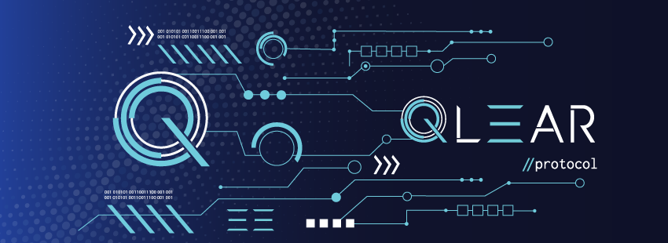

# Qlear Protocol (QLEAR) Token

The Ethereum contracts for the [Qlear Protocol](https://qlear.com) token  (QLEAR) and token distribution.

Check out [qlear.com](https://qlear.com) for details on how QLEAR is used to power the gaming trust machine. 
